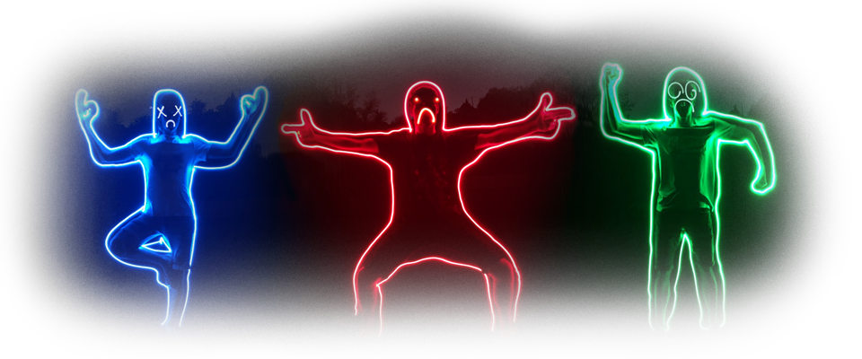

## I'm Vynokris, a Game Programmer

I am currently studying video game programming at the [ISART Digital Paris](https://www.isart.fr/) school.

To learn more about me or contact me, check out my [portfolio website](https://vynokris.github.io).

Some of my projects can be played on my [itch.io](https://vynokris.itch.io/) page.

<!--
**Vynokris/Vynokris** is a ✨ _special_ ✨ repository because its `README.md` (this file) appears on your GitHub profile.

Here are some ideas to get you started:

- 🔭 I’m currently working on ...
- 🌱 I’m currently learning ...
- 👯 I’m looking to collaborate on ...
- 🤔 I’m looking for help with ...
- 💬 Ask me about ...
- 📫 How to reach me: ...
- ⚡ Fun fact: ...
-->
